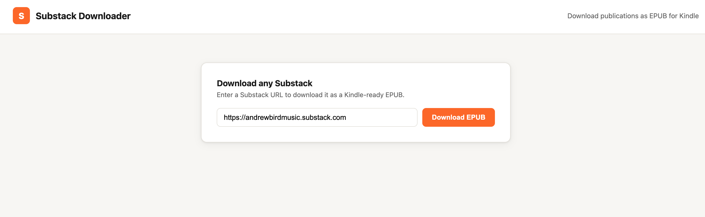
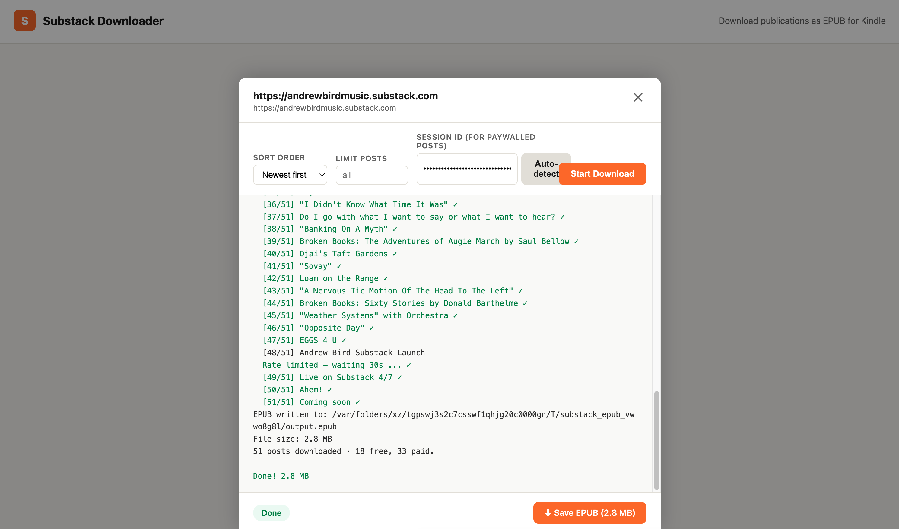

# substack2epub

Download any Substack publication as a Kindle-ready EPUB. Supports free and paywalled posts, embedded images, a table of contents, and a cover image. Comes with both a command-line interface and a web UI.

---

## Features

- Downloads all posts from any Substack (custom domains supported)
- Converts images to grayscale JPEG sized for Kindle Paperwhite
- Embeds images directly in the EPUB — no internet connection needed on device
- Handles paywalled posts for publications you subscribe to
- Sort by newest, oldest, or most popular
- Optional post limit
- Web UI with real-time download progress and one-click EPUB save
- Docker support for zero-dependency hosting

---

## Table of Contents

- [Requirements](#requirements)
- [Installation](#installation)
- [Command-Line Usage](#command-line-usage)
  - [Basic download](#basic-download)
  - [Paywalled posts](#paywalled-posts)
  - [Options](#options)
- [Web UI](#web-ui)
  - [Running the web UI](#running-the-web-ui)
  - [Using the web UI](#using-the-web-ui)
- [Docker](#docker)
- [Getting Your Session ID](#getting-your-session-id)

---

## Requirements

- Python 3.9+
- pip

## Installation

```bash
git clone https://github.com/kevinlong206/substack2epub.git
cd substack2epub
pip install -r requirements.txt
```

---

## Command-Line Usage

### Basic download

Downloads all free posts from a Substack and saves them as an EPUB in the current directory.

```bash
python3 substack2epub.py https://example.substack.com
```

Custom domains work too:

```bash
python3 substack2epub.py https://www.honest-broker.com
```

### Paywalled posts

To include posts behind the paywall, provide your Substack session cookie. This uses your credentials, so only posts from publications you are actively subscribed to will be downloaded. See [Getting Your Session ID](#getting-your-session-id) below.

**Interactive login (recommended — session is cached):**

```bash
python3 substack2epub.py https://example.substack.com --login
```

This triggers Substack's magic-link email flow:

1. Enter your Substack email address when prompted
2. Check your inbox for an email from Substack with a login link
3. Copy the full URL from that link and paste it back into the terminal

The session is saved to `~/.config/substack_epub/session.json` so you only need to authenticate once. Subsequent runs will reuse the cached session automatically.

**Paste the cookie directly:**

```bash
python3 substack2epub.py https://example.substack.com --session-id YOUR_SID
```

**Clear a saved session:**

```bash
python3 substack2epub.py --logout
```

### Options

| Flag | Description | Default |
|---|---|---|
| `--output FILE` | Output EPUB filename | `<Publication Name>.epub` |
| `--limit N` | Maximum number of posts to download | all |
| `--sort new` | Newest posts first | ✓ default |
| `--sort old` | Oldest posts first | |
| `--sort popular` | Most-liked posts first | |
| `--session-id SID` | Substack session cookie for paywalled content | |
| `--login` | Authenticate via magic-link email flow | |
| `--logout` | Clear cached session and exit | |

**Examples:**

```bash
# Download the 20 most popular posts
python3 substack2epub.py https://example.substack.com --sort popular --limit 20

# Save with a custom filename
python3 substack2epub.py https://example.substack.com --output my_book.epub

# Authenticated download, oldest-first
python3 substack2epub.py https://example.substack.com --login --sort old
```

---

## Web UI

The web UI provides a simple browser interface for downloading EPUBs with real-time progress streaming.

### Running the web UI

```bash
python3 app.py
```

Then open [http://localhost:5000](http://localhost:5000).

### Screenshots





### Using the web UI

Enter any Substack URL and click **Download EPUB**. A download panel opens with the following options:

| Option | Description |
|---|---|
| Sort order | Newest first, oldest first, or most popular |
| Limit posts | Download only the first N posts |
| Session ID | Your `substack.sid` cookie to include paywalled posts (subscriptions only) |

**Paywalled posts in the web UI**

To download paywalled posts from publications you subscribe to, paste your `substack.sid` cookie into the Session ID field. You can do this manually (see [Getting Your Session ID](#getting-your-session-id)), or click **Auto-detect** to have the app read the cookie directly from your local browser (Chrome, Firefox, or Safari). Auto-detect only works when running the web UI locally on the same machine as your browser — it will not work in Docker.

Click **Start Download**. Progress streams in real time. When complete, a **Save EPUB** button appears — click it to save the file to your computer.

> **Note:** The web UI is intended for local use. Do not expose it to the internet — your session cookie is sensitive and should never be entered into a third-party hosted service.

---

## Docker

Build the image:

```bash
docker build -t substack2epub .
```

Run it:

```bash
docker run -p 5000:5000 substack2epub
```

Then open [http://localhost:5000](http://localhost:5000).

Generated EPUBs are written to `/tmp` inside the container and are available for download through the browser during the session. To persist them to your host machine:

```bash
docker run -p 5000:5000 -v /tmp/epubs:/tmp substack2epub
```

---

## Getting Your Session ID

Your session ID is the `substack.sid` cookie set when you log in to Substack. It grants access to any publication you subscribe to.

1. Log in to [substack.com](https://substack.com) in your browser
2. Open DevTools (`F12` or `Cmd+Option+I`)
3. Go to **Application** → **Cookies** → `https://substack.com`
4. Find the cookie named `substack.sid` and copy its value

> **Keep this value private.** It authenticates you to Substack the same way your browser session does. Don't share it or commit it to version control.
